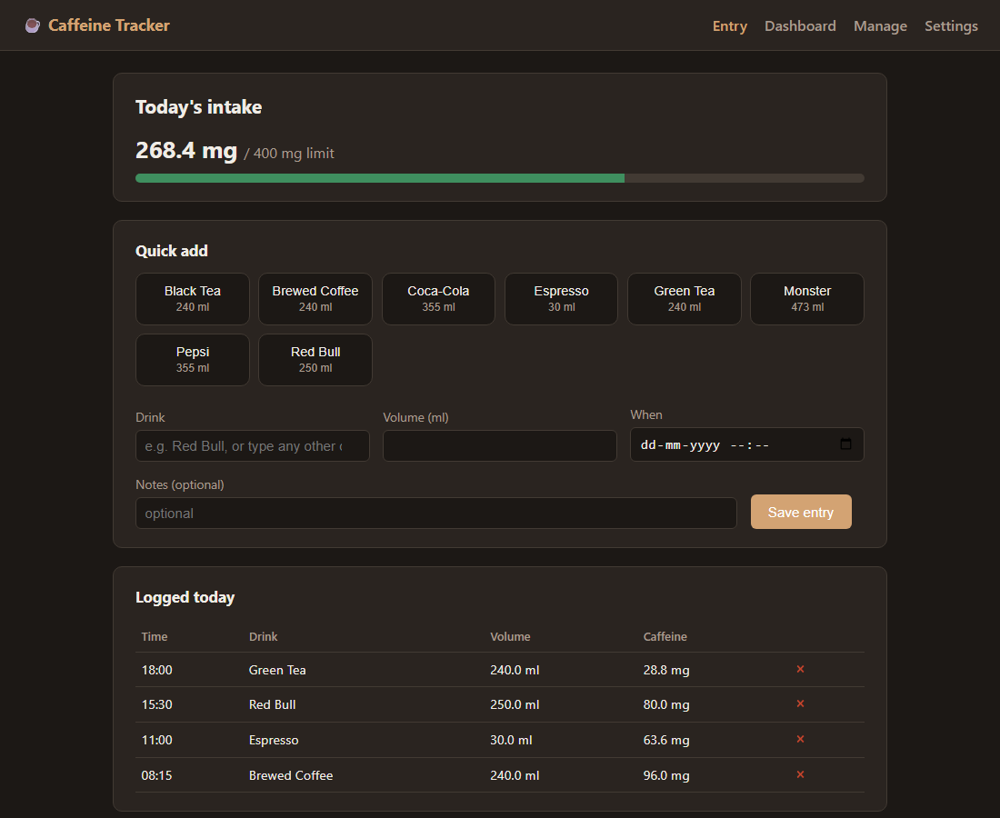
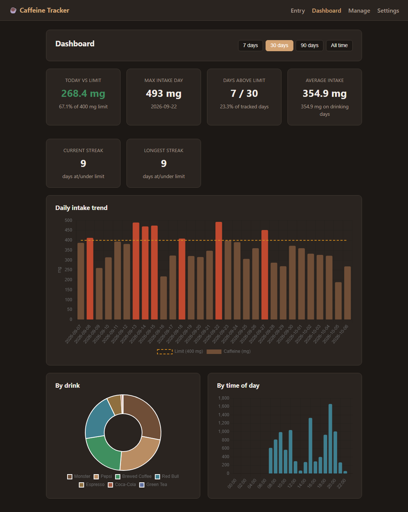
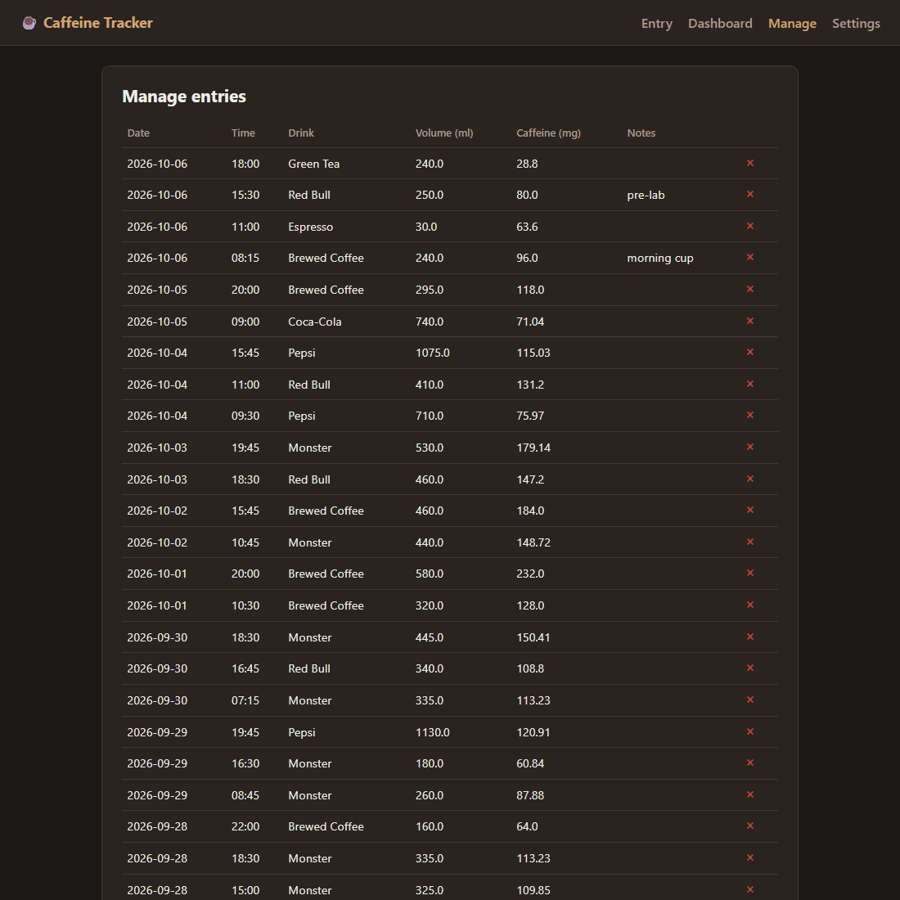
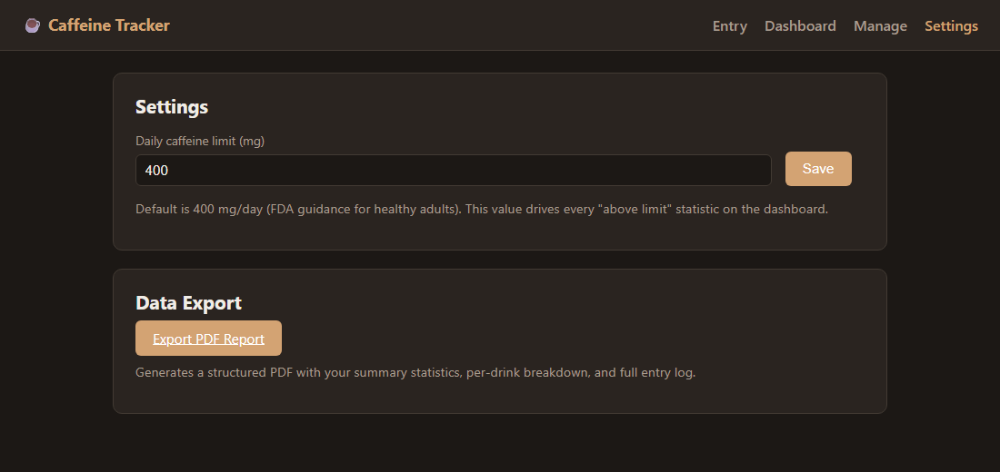

# Caffeine Tracker

A local, single-user app for Windows 11 that logs every caffeinated drink
you consume (in ml), computes the caffeine dose in mg, and shows a
dashboard of graphs and statistics — including your max-intake day and how
often you exceed the recommended 400 mg/day limit.

- **Quick entry** — one-tap presets (coffee, espresso, tea, Pepsi,
  Red Bull, Monster, …) with typical serving sizes pre-filled.
- **Any other drink** — type its name and the app looks up its caffeine
  content online (Open Food Facts → bundled reference table → manual).
- **Offline-first** — no internet? The entry is saved immediately and the
  lookup is queued and retried automatically later.
- **Dashboard** — daily trend vs the limit, max intake date, days above
  the limit (count and %), averages, per-drink breakdown, time-of-day
  pattern, streaks.
- **PDF export** — one click in Settings produces a PDF report of your
  summary stats, per-drink breakdown and full entry log
  ([sample](docs/sample_report.pdf)).
- **Private** — everything lives in one SQLite file on your laptop.

**Status: implemented.** All 4 phases are built and covered by tests
(`pytest tests/` — 55 passing). See the documents below for design detail.

## Mini-Project Submission

| | |
|---|---|
| **Student** | Mithunvel K.L |
| **Registration number** | 23BMH1029 |
| **Slot** | G2+TG2 |
| **Project title** | Caffeine Tracker |
| **Report** | [`project/PROJECT_REPORT.md`](project/PROJECT_REPORT.md) · PDF: [`docs/Mithunvel_K_L_23BMH1029_G2-TG2.pdf`](docs/Mithunvel_K_L_23BMH1029_G2-TG2.pdf) |

The report covers the **title, need, outcome and future perspectives**.

### In short

- **Need:** caffeine content is rarely labelled and intake is spread over many
  drinks in different sizes, so people cannot tell how close they are to the
  recommended 400 mg/day. Existing apps need accounts or internet.
- **Outcome:** a private, offline-first desktop tracker that converts ml to mg
  automatically, looks up unknown drinks, and shows trends, streaks and
  limit breaches — 55 automated tests passing.
- **Future:** caffeine half-life / sleep warnings, limit reminders, barcode
  scanning, wearable data correlation, optional encrypted sync, installer.

## Screenshots

Captured from the running app using synthetic data
(`scripts/seed_fake_data.py`).

| Entry | Dashboard |
|-------|-----------|
|  |  |

| Manage | Settings & PDF export |
|--------|-----------------------|
|  |  |

## Documents

| Document | What it covers |
|----------|----------------|
| [`project/PROJECT_REPORT.md`](project/PROJECT_REPORT.md) | Mini-project report: title, need, outcome, future perspectives |
| [`project/REQUIREMENTS.md`](project/REQUIREMENTS.md) | What the app must do (FR/NFR), reference caffeine values |
| [`project/PROJECT_PLAN.md`](project/PROJECT_PLAN.md) | Architecture decisions, repo layout, 4 build phases with success criteria |
| [`project/SCHEMA.md`](project/SCHEMA.md) | Database design, data-type decisions, statistics queries |
| [`CLAUDE.md`](CLAUDE.md) | Project brief for AI-assisted development sessions |
| [`TODO.md`](TODO.md) / [`Claude_log.md`](Claude_log.md) | Task tracker and session log |

## Tech stack

Python 3.12+ · Flask · SQLite · vanilla JS + Chart.js (bundled locally) ·
`pywebview` · YAML config · pytest. Flask serves the app on
`127.0.0.1` in a background thread; `pywebview` opens it in a native
desktop window (no browser tab) — nothing leaves your machine except
read-only caffeine lookups.

## Running on Windows 11

Prerequisite: [Python 3.12+](https://www.python.org/downloads/windows/)
with "Add python.exe to PATH" ticked during install.

```bat
git clone https://github.com/KL-Mithunvel/CAFFINE-TRACKER.git
cd CAFFINE-TRACKER
python -m venv .venv
.venv\Scripts\activate
pip install -r requirements.txt
python main.py
```

The app opens in its own window — not a browser tab. Double-clicking
`start_tracker.bat` does all of the above for you (creates the venv,
installs deps, runs `main.py`) with a visible console for logs/errors.

**Desktop shortcut:** run this once —

```bat
powershell -File scripts\create_desktop_shortcut.ps1
```

— to add a "Caffeine Tracker" shortcut to your Desktop that launches
silently (no console window). If something goes wrong with a silent
launch, check `logs\caffeine_tracker.log`.

**Backup:** copy `data\caffeine.db` anywhere — that one file is all your
data.

**Tests:** `pytest tests/` (55 tests). **Demo data:**
`python scripts\seed_fake_data.py` fills the dashboard with sample entries.

## Project structure

```
main.py                 entry point: Flask thread + pywebview window
config.yaml             port, DB path, lookup settings
app/
  db.py  schema.sql     SQLite connection, schema and seed data
  models.py             CRUD for drinks / entries / settings
  stats.py              all dashboard statistics
  lookup.py             Open Food Facts -> reference JSON -> manual, retry worker
  pdf_export.py         PDF report generator (ReportLab)
  routes.py             thin HTTP layer
  templates/ static/    Jinja2 pages, vanilla JS, vendored Chart.js
reference/              bundled offline caffeine table
scripts/                desktop shortcut + demo-data seeder
tests/                  pytest suite
project/                requirements, plan, schema, project report
docs/                   screenshots, sample PDF, submission PDF
```

## License

MIT — see [LICENSE](LICENSE).
